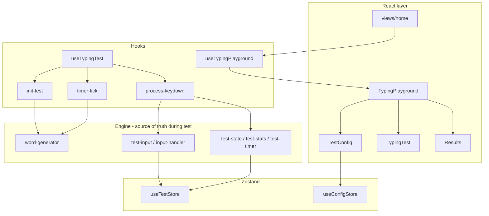

# Typing Playground

A focused typing test built with Next.js and React. Gameplay, stats, and word generation are adapted from [Monkeytype](https://github.com/monkeytypegame/monkeytype); this repo is a slimmer, modular Next.js app you can run and extend locally.

## What you get

- **Single-page typing test** — configure a mode, type words, see live stats, then review WPM, accuracy, and charts.
- **Five test modes** — time, words, quote, custom text, and zen.
- **Persisted settings** — test config and custom text survive reloads in `localStorage`.
- **Keyboard-first UX** — hidden input capture, shortcuts for restart and bail-out, config bar fades while you type.

## Test modes

| Mode       | What you type                                                       | How the test ends                           |
| ---------- | ------------------------------------------------------------------- | ------------------------------------------- |
| **Time**   | Random English words for a countdown (15–120s presets; default 30s) | Timer hits zero                             |
| **Words**  | A fixed number of random words (10–200 presets; default 25)         | Last word completed                         |
| **Quote**  | One random quote from the quote bank                                | Last word of the quote                      |
| **Custom** | Your own text (editor: repeat, shuffle, sections, word/time limits) | Depends on limit mode                       |
| **Zen**    | Open-ended; words extend as you type                                | Manual restart or bail-out (no auto-finish) |

**Time mode** keeps generating words during the test when you get close to the end of the list (same idea as Monkeytype timed tests).

**Quote mode** disables punctuation and numbers in config. Quotes load from `/public/quotes/{language}.json` (Monkeytype format). Only **english** is bundled today.

**Custom mode** opens a modal to edit text and limits. Empty custom text cannot start a test.

## Using the app

1. Open the home page and pick a **mode** in the config bar (Time, Words, Quote, Custom, Zen).
2. For **Time** or **Words**, set duration or word count with the preset chips.
3. Toggle **punctuation** and **numbers** when the mode supports them (not Custom or Zen; Quote forces them off).
4. Click the word area or start typing to focus the test. The config bar hides while focused.
5. When the test finishes, **Results** shows stats and a WPM chart. Use **Restart** or **Repeat** (same words).

### Shortcuts

| Action                     | Keys                                       |
| -------------------------- | ------------------------------------------ |
| Restart test               | `Esc` (Zen) or `Esc` / `Tab` (other modes) |
| Bail out (end active test) | `Shift` + `Enter`                          |
| Backspace                  | `Backspace`                                |

Sound, difficulty, blind mode, and many other options exist in the persisted config model; only a subset is exposed in the UI today (see [Configuration](#configuration)).

## Tech stack

- **Next.js 16** (App Router), **React 19**, **TypeScript**
- **Tailwind CSS 4** for styling
- **Zustand** for config, custom text, and test UI state
- **Framer Motion** for config bar layout
- **Chart.js** / **react-chartjs-2** for results
- **Howler** + Web Audio for key sounds
- **Vitest** for unit tests on pure logic

Requires **Node.js ≥ 24** and **pnpm ≥ 10**.

## Getting started

```bash
pnpm install
pnpm dev
```

Open [http://localhost:3000](http://localhost:3000).

### Other scripts

| Command             | Purpose                            |
| ------------------- | ---------------------------------- |
| `pnpm build`        | Production build                   |
| `pnpm start`        | Run production server              |
| `pnpm type-check`   | TypeScript (`tsc --noEmit`)        |
| `pnpm lint`         | ESLint                             |
| `pnpm test`         | Vitest (unit tests)                |
| `pnpm test:watch`   | Vitest watch mode                  |
| `pnpm format`       | Prettier write                     |
| `pnpm format:check` | Prettier check                     |
| `pnpm pr-preflight` | type-check, format, lint:fix, test |

## Project layout

```
app/                    # Next.js app shell (layout, page → Home)
views/home/             # Page-level layout and footer
ui/                     # Shared UI primitives (buttons, modal, segmented controls)
modules/typing/         # Typing product code
  components/           # TestConfig, TypingTest, Results, CustomTextModal, …
  hooks/                # useTypingPlayground, useTypingTest, typing-test/*
  engine/               # Test engine (no React)
    generation/         # Words per mode + word-generator router
    input/              # Keystrokes, validation, store sync
    runtime/            # Phase, timer, stats
  stores/               # Zustand (config, custom text, live test snapshot)
  services/             # Language/quote loaders, sound
  calculations/         # WPM, accuracy, consistency (pure functions)
public/
  languages/            # Word lists (english.json)
  quotes/               # Quote bank (english.json, Monkeytype format)
```

The home page wires everything together:

- `useTypingPlayground()` — focus, global keys, test lifecycle
- `<TypingPlayground playground={…} />` — config bar, typing area, or results

## How it works (runtime)



1. **Init / restart** — `runInitTest` loads the language JSON, calls `generateWords()` for the active mode, resets engine modules, and pushes words into `useTestStore`.
2. **Typing** — Keystrokes go through `processKeyDown` → `processChar` / `processBackspace`. Engine modules update; `syncInputSnapshot` / `syncStoreFromEngine` refresh the store for React.
3. **Timer** — Time (and timed custom) modes use `test-timer`; ticks update live WPM/accuracy and may append words via `getNextWord()`.
4. **Finish** — Completing the last word or the timer calls `runFinishTest`, which builds a `CompletedEvent` and shows **Results**.

Word generation is split by mode (`standard-words`, `custom-words`, `quote-words`) and routed through `word-generator.ts`. Shared helpers include `wordset`, `punctuation`, and `quotes`.

## Configuration

Settings live in Zustand and persist under:

- `typing-playground-config`
- `typing-playground-custom-text`

**Exposed in the UI:** mode, time/words presets, punctuation, numbers, custom text editor.

**Defaults only (persisted, not in TestConfig yet):** difficulty, blind mode, stop-on-error, lazy mode, live stat toggles, quote length groups, sound theme/volume, caret options, min accuracy/burst, and more. See `modules/typing/constants/config-defaults.ts` and `modules/typing/types/config.ts`.

## Data files

| Path                            | Role                                    |
| ------------------------------- | --------------------------------------- |
| `public/languages/english.json` | Word list for random modes              |
| `public/quotes/english.json`    | Quote bank (~2.2 MB, Monkeytype layout) |

Loaders validate language names (allowlist: `english` today) before fetching. To add languages, add matching JSON under `public/languages/` and `public/quotes/` and extend the allowlist in `services/language-loader.ts`.

## Contributing

- Run `pnpm pr-preflight` before opening a PR.
- Add Vitest tests next to pure logic (`*.test.ts` under `modules/typing/`).
- Agent and architecture conventions: **[AGENTS.md](./AGENTS.md)** (including when to check upstream Monkeytype for behavior).

## Lineage and license

Behavior and formulas are intentionally close to Monkeytype where ported; see `Source:` comments in modules for upstream file paths.

This project is private (`package.json`). Use and deploy according to your own terms and any obligations from Monkeytype’s license if you redistribute quote/language data or derived logic.
